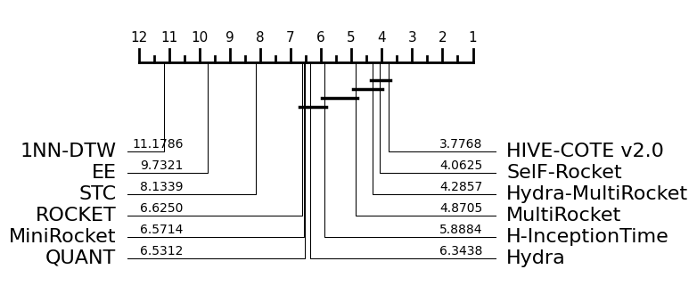
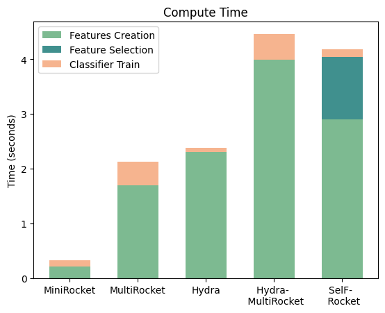
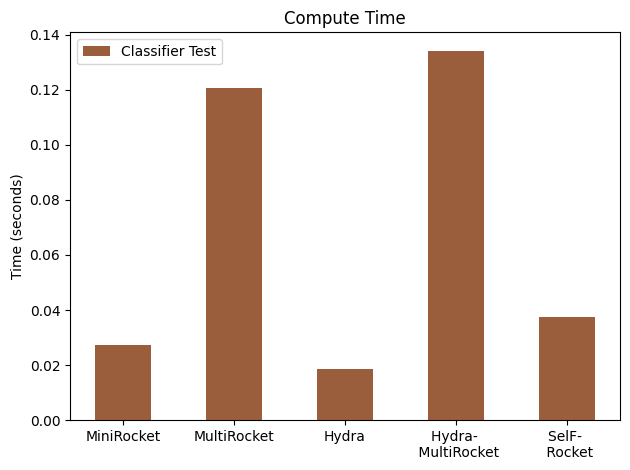

# SelF-Rocket


This repository contains the code related to the paper      

**Time series classification with random convolution kernels based transforms: pooling operators and input representations matter**

*Preprint*: [arxiv:2409.01115](https://arxiv.org/pdf/2409.01115)

> <div align="justify">This article presents a new approach based on MiniRocket, called SelF-Rocket (Selected Features Rocket), for fast time series classification (TSC). Unlike existing approaches based on random convolution kernels, it dynamically selects the best couple of input representations and pooling operator during the training process. SelF-Rocket achieves state-of-the-art accuracy on the University of California Riverside (UCR) TSC benchmark datasets.</div>

## Reference
Please cite:
```
@misc{lo2024timeseriesclassificationrandom,
      title={Time series classification with random convolution kernels based transforms: pooling operators and input representations matter}, 
      author={Mouhamadou Mansour Lo and Gildas Morvan and Mathieu Rossi and Fabrice Morganti and David Mercier},
      year={2024},
      eprint={2409.01115},
      archivePrefix={arXiv},
      primaryClass={cs.LG},
      url={https://arxiv.org/abs/2409.01115}, 
}
```

## Results

SelF-Rocket has been evaluated on the UCR archive. Results show it is as accurate as Hydra-MultiRocket and HIVE-COTE v2.0, despite having only one type of feature, relatively faster than Hydra-MultiRocket in term of training time and as fast as MiniRockect is term of prediction time.

### Comparison of SelF-Rocket and other SOTA methods performance (critical difference diagram)




###  Comparison of SelF-Rocket  and related methods training time



###  Comparison of SelF-Rocket  and related methods prediction time




## Reproducing the results

### Data
The paper [Bake off redux: a review and experimental evaluation of recent time series classification algorithms](https://arxiv.org/abs/2304.13029) provide with [tsml-eval](https://tsml-eval.readthedocs.io/en/latest/publications/2023/tsc_bakeoff/tsc_bakeoff_2023.html) a folder containing all the 112 UCR datatets with their 30 resamples available [here](https://drive.google.com/file/d/1V36LSZLAK6FIYRfPx6mmE5euzogcXS83/view)

### Performance of each couple IR-PO (Section 3)

To obtain Table 1 of our paper, run [mod_minirocket](./code/performance_mod_minirocket.py). It will generate a csv file with the mean performance of each IR-PO couple for all the 112 UCR datasets selected with 30 resamples.

### Feature Generation (Section 4)

While SelF-Rocket uses [MiniRocket](https://arxiv.org/abs/2012.08791) as baseline, our code is based on the original implementation of [MultiRocket](https://arxiv.org/abs/2102.00457). 9996 or 19992 features are extracted from each combinaison (IR-PO). In this implementation IR = {BASE,DIFF}, PO = {PPV,GMP,MPV,MIPV,LSPV}. The source code of the Feature Generation module is available [here](./code/features_generator.py)

### Performance of SelF-Rocket (Section 5)

To compute the data needed to plot Figures 4-12 and Tables 2-3, run [performance_self_rocket](./code/performance_self_rocket.py).

```
Arguments:
-fpk --features_per_kernel  type=int : number of PO
-fpc --features_per_classifier type=int : number of features per mini-classifier (max 9996)
-df --inputDataFolder type=str : path of datasets (required)
-dn --inputDatasetName type=str : name of the tested dataset (required)
-k --k_fold type=int : number of folds
-r --num_resamples type=int : number of resamples to use

Examples:
> py performance_self_rocket.py -df "../datasets_UCR_resamp_tsv/" -dn "ACSF1" 
> py performance_self_rocket.py -df "../datasets_UCR_resamp_tsv/" -dn "Adiac" -fpc 9996 -k 3
 
``` 


The mean performance (over 30 resamples) of SelF-Rocket (k = 2, f = 9996) on the 112 selected UCR datasets.

| dataset                        | SELECTED (IR-PO) | SelF-Rocket MEAN ACCURACY | MINIROCKET MEAN ACCURACY |
|--------------------------------|------------------|---------------------------|--------------------------|
| ACSF1                          | LSPV             | 0.85266674                | 0.8246666666666667       |
| Adiac                          | PPV_MIX          | 0.8285592                 | 0.8015345268542199       |
| ArrowHead                      | PPV_DIFF         | 0.8790476                 | 0.8832380952380954       |
| BME                            | PPV              | 0.9917778                 | 0.9919999999999998       |
| Beef                           | PPV_MIX          | 0.79666656                | 0.7655555555555554       |
| BeetleFly                      | GMP_DIFF         | 0.915                     | 0.9099999999999999       |
| BirdChicken                    | PPV_DIFF         | 0.9066666                 | 0.9183333333333332       |
| CBF                            | PPV              | 0.9961851                 | 0.9965185185185186       |
| Car                            | PPV_MIX          | 0.92611104                | 0.9205555555555556       |
| Chinatown                      | MIPV_MIX         | 0.97142863                | 0.9687074829931972       |
| ChlorineConcentration          | PPV_DIFF         | 0.78690106                | 0.753532986111111        |
| CinCECGTorso                   | MIPV_DIFF        | 0.96589375                | 0.8745169082125603       |
| Coffee                         | GMP              | 0.9988095                 | 0.9988095238095238       |
| Computers                      | PPV_DIFF         | 0.84840006                | 0.8033333333333332       |
| CricketX                       | PPV              | 0.8261538                 | 0.8241880341880342       |
| CricketY                       | PPV              | 0.8423931                 | 0.8399999999999999       |
| CricketZ                       | PPV              | 0.84247863                | 0.8391452991452992       |
| Crop                           | MPV_MIX          | 0.7698789                 | 0.7641011904761903       |
| DiatomSizeReduction            | GMP              | 0.9620915                 | 0.9436819172113288       |
| DistalPhalanxOutlineAgeGroup   | MIPV_MIX         | 0.8004796                 | 0.7944844124700239       |
| DistalPhalanxOutlineCorrect    | MIPV_DIFF        | 0.8385266                 | 0.8253623188405796       |
| DistalPhalanxTW                | MIPV             | 0.69472414                | 0.6892086330935251       |
| ECG200                         | PPV              | 0.9020001                 | 0.8990000000000002       |
| ECG5000                        | MPV_MIX          | 0.94739264                | 0.9464888888888888       |
| ECGFiveDays                    | GMP              | 0.99686414                | 0.9905536198219127       |
| EOGHorizontalSignal            | MPV_MIX          | 0.86556166                | 0.8360957642725599       |
| EOGVerticalSignal              | MPV_MIX          | 0.8213628                 | 0.7995395948434623       |
| Earthquakes                    | LSPV_DIFF        | 0.7482014                 | 0.7333333333333332       |
| ElectricDevices                | PPV_MIX          | 0.8915704                 | 0.8745774434790127       |
| EthanolLevel                   | LSPV             | 0.7086001                 | 0.6635333333333334       |
| FaceAll                        | PPV              | 0.98347145                | 0.983293885601578        |
| FaceFour                       | PPV              | 0.94242436                | 0.9412878787878787       |
| FacesUCR                       | PPV              | 0.96915436                | 0.9686016260162602       |
| FiftyWords                     | PPV_MIX          | 0.83692306                | 0.8284981684981686       |
| Fish                           | PPV_DIFF         | 0.9820952                 | 0.9754285714285716       |
| FordA                          | LSPV_MIX         | 0.9507071                 | 0.9449747474747474       |
| FordB                          | LSPV_MIX         | 0.92720157                | 0.9207818930041152       |
| FreezerRegularTrain            | PPV_DIFF         | 0.9993684                 | 0.9990877192982457       |
| FreezerSmallTrain              | LSPV             | 0.9934503                 | 0.9876023391812866       |
| GunPoint                       | LSPV_MIX         | 0.9984445                 | 0.9919999999999999       |
| GunPointAgeSpan                | LSPV_MIX         | 0.99757385                | 0.9924050632911392       |
| GunPointMaleVersusFemale       | LSPV             | 0.9998945                 | 1.0                      |
| GunPointOldVersusYoung         | PPV              | 1.0                       | 1.0                      |
| Ham                            | MIPV             | 0.8520635                 | 0.8488888888888889       |
| HandOutlines                   | MIPV_MIX         | 0.9448648                 | 0.9382882882882881       |
| Haptics                        | LSPV             | 0.5507576                 | 0.5452380952380953       |
| Herring                        | MIPV             | 0.63958335                | 0.6088541666666667       |
| HouseTwenty                    | MPV_DIFF         | 0.9647059                 | 0.965546218487395        |
| InlineSkate                    | GMP_MIX          | 0.5071515                 | 0.4896363636363636       |
| InsectEPGRegularTrain          | MPV              | 1.0                       | 1.0                      |
| InsectEPGSmallTrain            | LSPV             | 0.9942436                 | 0.993172690763052        |
| InsectWingbeatSound            | MIPV_DIFF        | 0.66511786                | 0.6575420875420875       |
| ItalyPowerDemand               | MIPV_MIX         | 0.96595407                | 0.9602202785876254       |
| LargeKitchenAppliances         | MPV_MIX          | 0.92924446                | 0.9024000000000001       |
| Lightning2                     | PPV              | 0.7633879                 | 0.7601092896174866       |
| Lightning7                     | MPV              | 0.79908687                | 0.7771689497716895       |
| Mallat                         | MPV_MIX          | 0.9636532                 | 0.9551528073916135       |
| Meat                           | MPV              | 0.995                     | 0.9933333333333335       |
| MedicalImages                  | PPV              | 0.8036842                 | 0.8048245614035087       |
| MiddlePhalanxOutlineAgeGroup   | MIPV_DIFF        | 0.66580075                | 0.6502164502164501       |
| MiddlePhalanxOutlineCorrect    | MPV_MIX          | 0.84776634                | 0.843413516609393        |
| MiddlePhalanxTW                | MIPV_DIFF        | 0.56580085                | 0.5541125541125542       |
| MixedShapesRegularTrain        | PPV_DIFF         | 0.9762612                 | 0.9693745704467354       |
| MixedShapesSmallTrain          | PPV_DIFF         | 0.9485224                 | 0.9421030927835052       |
| MoteStrain                     | PPV              | 0.91400427                | 0.9136581469648563       |
| NonInvasiveFetalECGThorax1     | MPV_MIX          | 0.9620525                 | 0.9518066157760815       |
| NonInvasiveFetalECGThorax2     | PPV_MIX          | 0.9662596                 | 0.9635114503816793       |
| OSULeaf                        | PPV_MIX          | 0.96831965                | 0.9568870523415979       |
| OliveOil                       | PPV              | 0.9133333                 | 0.9155555555555556       |
| PhalangesOutlinesCorrect       | PPV_MIX          | 0.85384613                | 0.8457653457653458       |
| Phoneme                        | LSPV_MIX         | 0.35685655                | 0.2908403656821379       |
| PigAirwayPressure              | LSPV_MIX         | 0.94967955                | 0.8748397435897437       |
| PigArtPressure                 | LSPV_MIX         | 0.96217954                | 0.9596153846153848       |
| PigCVP                         | LSPV_MIX         | 0.907532                  | 0.9179487179487179       |
| Plane                          | PPV_DIFF         | 1.0                       | 1.0                      |
| PowerCons                      | MIPV             | 0.9831482                 | 0.9838888888888887       |
| ProximalPhalanxOutlineAgeGroup | MIPV_DIFF        | 0.84894305                | 0.8450406504065041       |
| ProximalPhalanxOutlineCorrect  | MPV_MIX          | 0.9058419                 | 0.8961053837342499       |
| ProximalPhalanxTW              | MIPV_DIFF        | 0.8107316                 | 0.8032520325203251       |
| RefrigerationDevices           | LSPV_MIX         | 0.75582224                | 0.707822222222222        |
| Rock                           | LSPV_MIX         | 0.85933334                | 0.8046666666666666       |
| ScreenType                     | PPV_DIFF         | 0.6361777                 | 0.5584888888888889       |
| SemgHandGenderCh2              | MIPV             | 0.9523888                 | 0.9108333333333334       |
| SemgHandMovementCh2            | MIPV             | 0.7922963                 | 0.6834074074074075       |
| SemgHandSubjectCh2             | MIPV             | 0.93103707                | 0.8821481481481481       |
| ShapeletSim                    | LSPV             | 1.0                       | 0.9996296296296295       |
| ShapesAll                      | LSPV_MIX         | 0.94088894                | 0.9349444444444444       |
| SmallKitchenAppliances         | LSPV             | 0.82595557                | 0.8137777777777779       |
| SmoothSubspace                 | MIPV_MIX         | 0.9731111                 | 0.9586666666666667       |
| SonyAIBORobotSurface1          | GMP_MIX          | 0.95546305                | 0.9480865224625624       |
| SonyAIBORobotSurface2          | PPV_DIFF         | 0.9566981                 | 0.9415879678209162       |
| StarLightCurves                | PPV_MIX          | 0.9815849                 | 0.9814351627003399       |
| Strawberry                     | PPV_MIX          | 0.98072076                | 0.9791891891891892       |
| SwedishLeaf                    | PPV_MIX          | 0.97338676                | 0.9615466666666668       |
| Symbols                        | PPV_MIX          | 0.9761808                 | 0.9670686767169179       |
| SyntheticControl               | MPV_MIX          | 0.99344444                | 0.9912222222222222       |
| ToeSegmentation1               | LSPV             | 0.9402046                 | 0.9410818713450291       |
| ToeSegmentation2               | MPV              | 0.9405128                 | 0.9410256410256408       |
| Trace                          | PPV              | 1.0                       | 1.0                      |
| TwoLeadECG                     | GMP_DIFF         | 0.998127                  | 0.9973075797483174       |
| TwoPatterns                    | MPV              | 0.99999166                | 0.994975                 |
| UMD                            | PPV_MIX          | 0.9916666                 | 0.9905092592592594       |
| UWaveGestureLibraryAll         | MIPV_MIX         | 0.98291457                | 0.9749860413176996       |
| UWaveGestureLibraryX           | PPV_MIX          | 0.864666                  | 0.8566815559277872       |
| UWaveGestureLibraryY           | PPV_MIX          | 0.80030704                | 0.7867857807556298       |
| UWaveGestureLibraryZ           | PPV_MIX          | 0.80918485                | 0.8015726782058441       |
| Wafer                          | PPV_DIFF         | 0.99996215                | 0.9988860047588145       |
| Wine                           | GMP_MIX          | 0.91913587                | 0.9290123456790124       |
| WordSynonyms                   | PPV_MIX          | 0.7739289                 | 0.7682863113897596       |
| Worms                          | PPV_MIX          | 0.74112564                | 0.7320346320346319       |
| WormsTwoClass                  | PPV_MIX          | 0.78138524                | 0.7913419913419912       |
| Yoga                           | PPV_MIX          | 0.9329999                 | 0.9190666666666666       |


## Acknowledgements

This research project, supported and financed by the ANR (Agence Nationale pour la Recherche), is part of the Labcom (Laboratoire Commun) MYEL (MobilitY and Reliability of Electrical chain Lab) involving LSEE, LGI2A and CRITTM2A.
