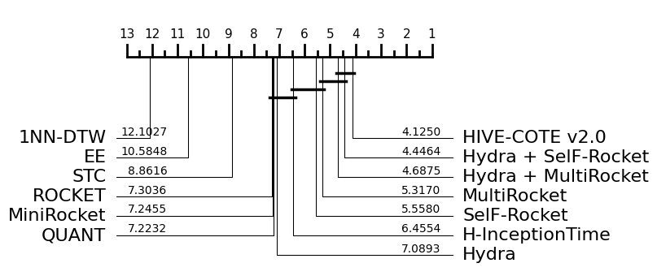
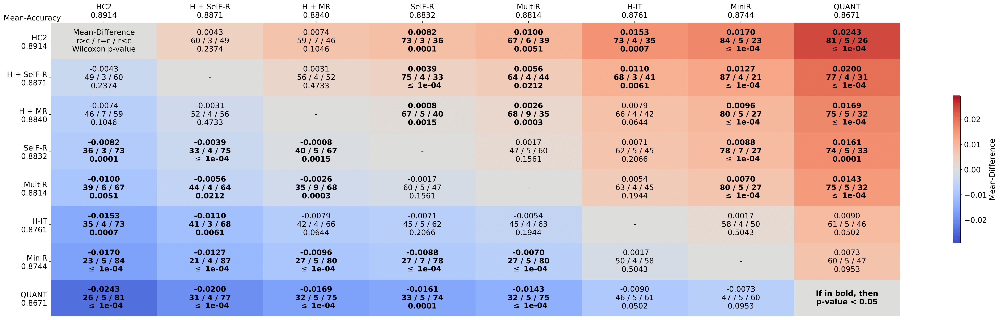

# SelF-Rocket


This repository contains the code related to the paper      

**Time series classification with random convolution kernels based transforms: pooling operators and input representations matter**

*Preprint*: [arxiv:2409.01115](https://arxiv.org/pdf/2409.01115)

> <div align="justify">This article presents a new approach based on MiniRocket, called SelF-Rocket, for fast time series classification (TSC). Unlike existing approaches based on random convolution kernels, it dynamically selects the best couple of input representations and pooling operator during the training process. SelF-Rocket achieves state-of-the-art accuracy on the University of California Riverside (UCR) TSC benchmark datasets.</div>

## Reference
Please cite:
```
@misc{lo2024timeseriesclassificationrandom,
      title={Time series classification with random convolution kernels based transforms: pooling operators and input representations matter}, 
      author={Mouhamadou Mansour Lo and Gildas Morvan and Mathieu Rossi and Fabrice Morganti and David Mercier},
      year={2024},
      eprint={2409.01115},
      archivePrefix={arXiv},
      primaryClass={cs.LG},
      url={https://arxiv.org/abs/2409.01115}, 
}
```

## Results

**Note:  Results initially presented were incorrect.**

Hydra + SelF-Rocket is as accurate as Hydra + MultiRocket and HIVE-COTE v2.0, despite having less features, and also has a relatively shorter classifier prediction time.

### Comparison of SelF-Rocket and other SOTA methods performance (critical difference diagram and heatmap)





## Reproducing the results

### Data
The paper [Bake off redux: a review and experimental evaluation of recent time series classification algorithms](https://arxiv.org/abs/2304.13029) provide with [tsml-eval](https://tsml-eval.readthedocs.io/en/latest/publications/2023/tsc_bakeoff/tsc_bakeoff_2023.html) a folder containing all the 112 UCR datatets with their 30 resamples available [here](https://drive.google.com/file/d/1V36LSZLAK6FIYRfPx6mmE5euzogcXS83/view)

### Performance of each couple IR-PO (Section 3)

To obtain Table 1 of our paper, run [mod_minirocket](./code/performance_mod_minirocket.py). It will generate a csv file with the mean performance of each IR-PO couple for all the 112 UCR datasets selected with 30 resamples.

### Feature Generation (Section 4)

While SelF-Rocket uses [MiniRocket](https://arxiv.org/abs/2012.08791) as baseline, our code is based on the original implementation of [MultiRocket](https://arxiv.org/abs/2102.00457). 9996 or 19992 features are extracted from each combinaison (IR-PO). In this implementation IR = {BASE,DIFF}, PO = {PPV,GMP,MPV,MIPV,LSPV}. The source code of the Feature Generation module is available [here](./code/features_generator.py)

### Performance of SelF-Rocket (Section 5)

To obtain the data required for the critical difference diagram and the heatmap, for SelF-Rocket run    [main_ucr112_SR](./code/main_ucr112_SR.py) and for Hydra SelF-Rocket run [main_ucr112_HSR](./code/main_ucr112_HSR.py)

```
Arguments:
-df --inputDataFolder type=str : path of datasets (required)
-fpc --num_features_pc type=int : number of features to use per mini-classifier
-r --num_resamples type=int : number of resamples to use
-nr --num_runs type=int : number of runs to do
-ir --only_mix type=bool : only use the MIX representation as Input Representation

Examples:
> py main_ucr112_SR.py -df "../datasets_UCR_resamp_tsv/" -fpc 5000 -nr 10 -ir
> py main_ucr112_HSR.py -df "../datasets_UCR_resamp_tsv/" -fpc 5000 -nr 10
 
``` 
This will generate three files : a main file containing the mean accuracy over 30 resamples for each dataset (e.g. [Mean_perf_SR](./results/Mean_perf_SR_UCR112_fpc5000_nr10.csv), [Mean_perf_HSR](./results/Mean_perf_HSR_UCR112_fpc5000_nr10.csv)), a second file containing the accuracy for each resample for all datasets (e.g. [Perf_rsmpl_SR](./results/Perf_rsmpl_SR_UCR112_fpc5000_nr10.csv), [Perf_rsmpl_HSR](./results/Perf_rsmpl_HSR_UCR112_fpc5000_nr10.csv)) and a third file containing the selected IR-PO for each resample and dataset (e.g. [IR_PO_rsmpl_SR](./results/IR_PO_rsmpl_SR_UCR112_fpc5000_nr10.csv), [IR_PO_rsmpl_HSR](./results/IR_PO_rsmpl_HSR_UCR112_fpc5000_nr10.csv)).

The mean performance (over 30 resamples) of SelF-Rocket & Hydra SelF-Rocket (f = 5000, nr = 10) on the 112 selected UCR datasets.

| dataset                        | SelF-Rocket MEAN ACCURACY | Hydra SelF-Rocket MEAN ACCURACY | MiniRocket MEAN ACCURACY |
|--------------------------------|---------------------------|---------------------------------|--------------------------|
| ACSF1                          | 0.8313333333333333        | 0.8396666666666667              | 0.8246666666666667       |
| Adiac                          | 0.824467178175618         | 0.8349531116794545              | 0.8015345268542199       |
| ArrowHead                      | 0.8862857142857143        | 0.8828571428571428              | 0.8832380952380954       |
| BME                            | 0.9926666666666665        | 0.998                           | 0.9919999999999998       |
| Beef                           | 0.791111111111111         | 0.7766666666666667              | 0.7655555555555554       |
| BeetleFly                      | 0.9099999999999999        | 0.9533333333333333              | 0.9099999999999999       |
| BirdChicken                    | 0.9049999999999998        | 0.9066666666666665              | 0.9183333333333332       |
| CBF                            | 0.9946296296296296        | 0.9949259259259259              | 0.9965185185185186       |
| Car                            | 0.9272222222222221        | 0.9222222222222223              | 0.9205555555555556       |
| Chinatown                      | 0.9661807580174927        | 0.9665694849368317              | 0.9687074829931972       |
| ChlorineConcentration          | 0.7859288194444446        | 0.7746354166666667              | 0.753532986111111        |
| CinCECGTorso                   | 0.9538888888888887        | 0.9958212560386475              | 0.8745169082125603       |
| Coffee                         | 0.9988095238095238        | 0.9976190476190477              | 0.9988095238095238       |
| Computers                      | 0.8436000000000002        | 0.8698666666666668              | 0.8033333333333332       |
| CricketX                       | 0.823931623931624         | 0.8278632478632478              | 0.8241880341880342       |
| CricketY                       | 0.8370940170940171        | 0.8457264957264955              | 0.8399999999999999       |
| CricketZ                       | 0.8388888888888888        | 0.8443589743589742              | 0.8391452991452992       |
| Crop                           | 0.7663511904761903        | 0.7705376984126983              | 0.7641011904761903       |
| DiatomSizeReduction            | 0.9508714596949889        | 0.9405228758169933              | 0.9436819172113288       |
| DistalPhalanxOutlineAgeGroup   | 0.7978417266187049        | 0.8002398081534773              | 0.7944844124700239       |
| DistalPhalanxOutlineCorrect    | 0.8399758454106279        | 0.8379227053140096              | 0.8253623188405796       |
| DistalPhalanxTW                | 0.6961630695443647        | 0.696642685851319               | 0.6892086330935251       |
| ECG200                         | 0.8930000000000001        | 0.8960000000000001              | 0.8990000000000002       |
| ECG5000                        | 0.9465629629629629        | 0.9474296296296297              | 0.9464888888888888       |
| ECGFiveDays                    | 0.9905923344947735        | 0.9948122338366243              | 0.9905536198219127       |
| EOGHorizontalSignal            | 0.8599447513812155        | 0.8624309392265194              | 0.8360957642725599       |
| EOGVerticalSignal              | 0.8018416206261509        | 0.8113259668508285              | 0.7995395948434623       |
| Earthquakes                    | 0.7441247002398081        | 0.7434052757793765              | 0.7333333333333332       |
| ElectricDevices                | 0.891605066355423         | 0.9003587947953141              | 0.8745774434790127       |
| EthanolLevel                   | 0.7085999999999999        | 0.7054666666666666              | 0.6635333333333334       |
| FaceAll                        | 0.982879684418146         | 0.9835305719921105              | 0.983293885601578        |
| FaceFour                       | 0.9397727272727271        | 0.9109848484848485              | 0.9412878787878787       |
| FacesUCR                       | 0.9680162601626017        | 0.9655934959349594              | 0.9686016260162602       |
| FiftyWords                     | 0.8305494505494507        | 0.8391208791208792              | 0.8284981684981686       |
| Fish                           | 0.9782857142857144        | 0.9832380952380951              | 0.9754285714285716       |
| FordA                          | 0.9492424242424243        | 0.9562121212121213              | 0.9449747474747474       |
| FordB                          | 0.9235802469135802        | 0.9318106995884773              | 0.9207818930041152       |
| FreezerRegularTrain            | 0.9990643274853802        | 0.9982573099415204              | 0.9990877192982457       |
| FreezerSmallTrain              | 0.9887251461988303        | 0.9816140350877195              | 0.9876023391812866       |
| GunPoint                       | 0.9948888888888888        | 0.9986666666666666              | 0.9919999999999999       |
| GunPointAgeSpan                | 0.9932489451476791        | 0.9947257383966245              | 0.9924050632911392       |
| GunPointMaleVersusFemale       | 0.9998945147679325        | 0.9998945147679325              | 1.0                      |
| GunPointOldVersusYoung         | 1.0                       | 1.0                             | 1.0                      |
| Ham                            | 0.8434920634920636        | 0.8542857142857144              | 0.8488888888888889       |
| HandOutlines                   | 0.9403603603603603        | 0.947117117117117               | 0.9382882882882881       |
| Haptics                        | 0.5164502164502165        | 0.5372294372294372              | 0.5452380952380953       |
| Herring                        | 0.6088541666666667        | 0.6151041666666667              | 0.6088541666666667       |
| HouseTwenty                    | 0.965266106442577         | 0.973389355742297               | 0.965546218487395        |
| InlineSkate                    | 0.5087878787878787        | 0.5267878787878787              | 0.4896363636363636       |
| InsectEPGRegularTrain          | 1.0                       | 1.0                             | 1.0                      |
| InsectEPGSmallTrain            | 0.9929049531459169        | 0.9962516733601071              | 0.993172690763052        |
| InsectWingbeatSound            | 0.6621717171717172        | 0.6635858585858586              | 0.6575420875420875       |
| ItalyPowerDemand               | 0.9634272756721737        | 0.9628441852931647              | 0.9602202785876254       |
| LargeKitchenAppliances         | 0.9294222222222223        | 0.9394666666666666              | 0.9024000000000001       |
| Lightning2                     | 0.7426229508196722        | 0.7721311475409836              | 0.7601092896174866       |
| Lightning7                     | 0.787671232876712         | 0.8041095890410958              | 0.7771689497716895       |
| Mallat                         | 0.9562046908315567        | 0.9612935323383084              | 0.9551528073916135       |
| Meat                           | 0.9916666666666667        | 0.9877777777777779              | 0.9933333333333335       |
| MedicalImages                  | 0.8000438596491226        | 0.8057017543859649              | 0.8048245614035087       |
| MiddlePhalanxOutlineAgeGroup   | 0.656926406926407         | 0.6703463203463204              | 0.6502164502164501       |
| MiddlePhalanxOutlineCorrect    | 0.8484536082474228        | 0.8476517754868271              | 0.843413516609393        |
| MiddlePhalanxTW                | 0.5493506493506495        | 0.5621212121212122              | 0.5541125541125542       |
| MixedShapesRegularTrain        | 0.9758625429553264        | 0.9811546391752579              | 0.9693745704467354       |
| MixedShapesSmallTrain          | 0.9488522336769757        | 0.9571408934707905              | 0.9421030927835052       |
| MoteStrain                     | 0.909797657082002         | 0.925612353567625               | 0.9136581469648563       |
| NonInvasiveFetalECGThorax1     | 0.960033927056828         | 0.9619677692960135              | 0.9518066157760815       |
| NonInvasiveFetalECGThorax2     | 0.9662595419847327        | 0.9706870229007633              | 0.9635114503816793       |
| OSULeaf                        | 0.9672176308539944        | 0.977961432506887               | 0.9568870523415979       |
| OliveOil                       | 0.9111111111111112        | 0.9066666666666666              | 0.9155555555555556       |
| PhalangesOutlinesCorrect       | 0.8521367521367521        | 0.8518259518259519              | 0.8457653457653458       |
| Phoneme                        | 0.3415611814345992        | 0.35079113924050637             | 0.2908403656821379       |
| PigAirwayPressure              | 0.9267628205128204        | 0.9102564102564101              | 0.8748397435897437       |
| PigArtPressure                 | 0.9580128205128204        | 0.9647435897435898              | 0.9596153846153848       |
| PigCVP                         | 0.9078525641025641        | 0.9100961538461539              | 0.9179487179487179       |
| Plane                          | 1.0                       | 1.0                             | 1.0                      |
| PowerCons                      | 0.9800000000000001        | 0.9722222222222222              | 0.9838888888888887       |
| ProximalPhalanxOutlineAgeGroup | 0.8447154471544714        | 0.8479674796747968              | 0.8450406504065041       |
| ProximalPhalanxOutlineCorrect  | 0.9088201603665522        | 0.904696449026346               | 0.8961053837342499       |
| ProximalPhalanxTW              | 0.801788617886179         | 0.8087804878048781              | 0.8032520325203251       |
| RefrigerationDevices           | 0.7517333333333334        | 0.7849777777777778              | 0.707822222222222        |
| Rock                           | 0.8366666666666664        | 0.8713333333333334              | 0.8046666666666666       |
| ScreenType                     | 0.628                     | 0.6789333333333334              | 0.5584888888888889       |
| SemgHandGenderCh2              | 0.9523888888888891        | 0.9360555555555554              | 0.9108333333333334       |
| SemgHandMovementCh2            | 0.7934814814814815        | 0.7388148148148148              | 0.6834074074074075       |
| SemgHandSubjectCh2             | 0.9304444444444445        | 0.9127407407407409              | 0.8821481481481481       |
| ShapeletSim                    | 0.9998148148148148        | 0.9938888888888887              | 0.9996296296296295       |
| ShapesAll                      | 0.9408888888888889        | 0.9481111111111111              | 0.9349444444444444       |
| SmallKitchenAppliances         | 0.8246222222222223        | 0.8369777777777778              | 0.8137777777777779       |
| SmoothSubspace                 | 0.9702222222222222        | 0.9622222222222223              | 0.9586666666666667       |
| SonyAIBORobotSurface1          | 0.9505268996117582        | 0.9490848585690514              | 0.9480865224625624       |
| SonyAIBORobotSurface2          | 0.953690101434068         | 0.9515564882826162              | 0.9415879678209162       |
| StarLightCurves                | 0.9816982353893476        | 0.9815525335923587              | 0.9814351627003399       |
| Strawberry                     | 0.9805405405405409        | 0.9804504504504504              | 0.9791891891891892       |
| SwedishLeaf                    | 0.9731733333333332        | 0.9767466666666667              | 0.9615466666666668       |
| Symbols                        | 0.971356783919598         | 0.9740703517587941              | 0.9670686767169179       |
| SyntheticControl               | 0.9908888888888888        | 0.990111111111111               | 0.9912222222222222       |
| ToeSegmentation1               | 0.9403508771929825        | 0.9421052631578948              | 0.9410818713450291       |
| ToeSegmentation2               | 0.9397435897435895        | 0.9487179487179485              | 0.9410256410256408       |
| Trace                          | 1.0                       | 1.0                             | 1.0                      |
| TwoLeadECG                     | 0.997161252560726         | 0.998478197249049               | 0.9973075797483174       |
| TwoPatterns                    | 0.9997333333333333        | 0.9978083333333334              | 0.994975                 |
| UMD                            | 0.9886574074074074        | 0.9884259259259259              | 0.9905092592592594       |
| UWaveGestureLibraryAll         | 0.9818816303740926        | 0.9828773497115206              | 0.9749860413176996       |
| UWaveGestureLibraryX           | 0.8629629629629628        | 0.872175693281221               | 0.8566815559277872       |
| UWaveGestureLibraryY           | 0.7980271729015449        | 0.8073422668900055              | 0.7867857807556298       |
| UWaveGestureLibraryZ           | 0.8064209938581798        | 0.8160524846454494              | 0.8015726782058441       |
| Wafer                          | 0.9998431754272118        | 0.9999513303049968              | 0.9988860047588145       |
| Wine                           | 0.928395061728395         | 0.9320987654320986              | 0.9290123456790124       |
| WordSynonyms                   | 0.7694879832810868        | 0.777533960292581               | 0.7682863113897596       |
| Worms                          | 0.7376623376623377        | 0.7532467532467533              | 0.7320346320346319       |
| WormsTwoClass                  | 0.7805194805194806        | 0.7913419913419913              | 0.7913419913419912       |
| Yoga                           | 0.9311333333333334        | 0.9389999999999998              | 0.9190666666666666       |


## Usage of SelF-Rocket & Hydra-SelF-Rocket Classifier

```python
from self_rocket import SelFRocket

# The shape could be (num_examples,ts_length) or (num_examples,1,ts_length)

X_train, y_train = ...
X_test, y_test = ...

model = SelFRocket(num_runs = 10, num_features_pc = 5000, only_MIX = False)
model.fit(X_train,y_train)

y_pred = model.predict(X_test)
``` 

```python
from hydra_self_rocket import HydraSelFRocket

# The shape could be (num_examples,ts_length) or (num_examples,1,ts_length)

X_train, y_train = ...
X_test, y_test = ...

model = HydraSelFRocket(num_runs = 10, num_features_pc = 5000, only_MIX = False)
model.fit(X_train,y_train)

y_pred = model.predict(X_test)
``` 

## Acknowledgements

This research project, supported and financed by the ANR (Agence Nationale pour la Recherche), is part of the Labcom (Laboratoire Commun) MYEL (MobilitY and Reliability of Electrical chain Lab) involving LSEE, LGI2A and CRITTM2A.

